# Sparta Typing Architecture Diagrams

このドキュメントは、プロジェクト全体を把握するための図を次の順にまとめたものです。

1. プロジェクト概要図
2. ディレクトリ / モジュール構成図
3. 主要機能ごとの関数呼び出し図
4. ER図
5. データフロー図
6. シーケンス図

## 1. プロジェクト概要図

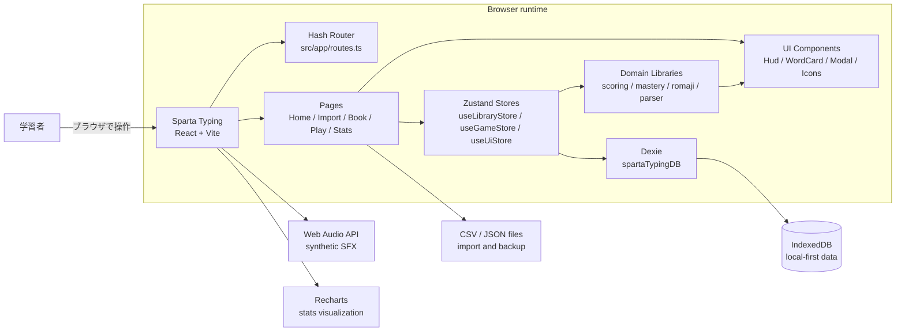

## 2. ディレクトリ / モジュール構成図

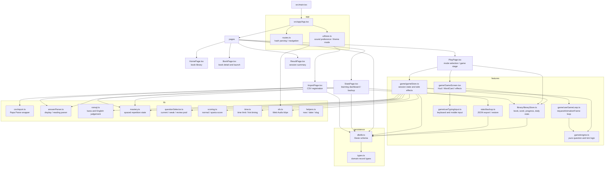

## 3. 主要機能ごとの関数呼び出し図

### 3.1 CSV登録

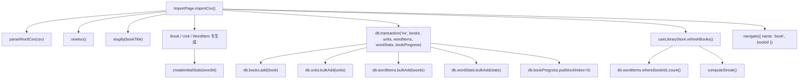

### 3.2 ゲーム開始と出題

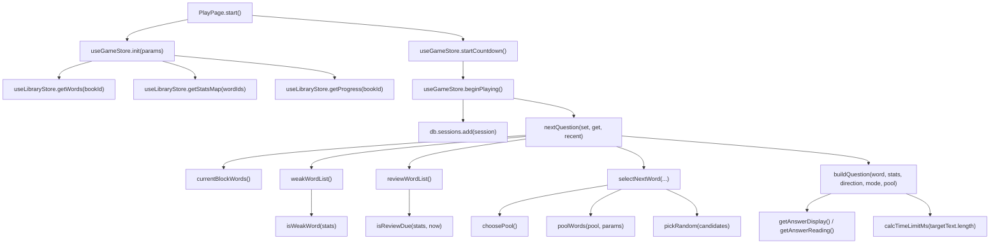

### 3.3 入力判定と回答確定

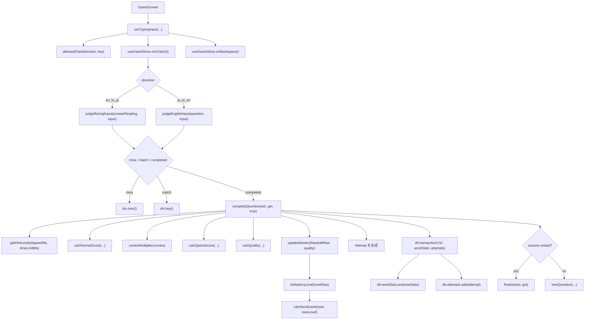

### 3.4 タイマー、ヒント、セッション終了

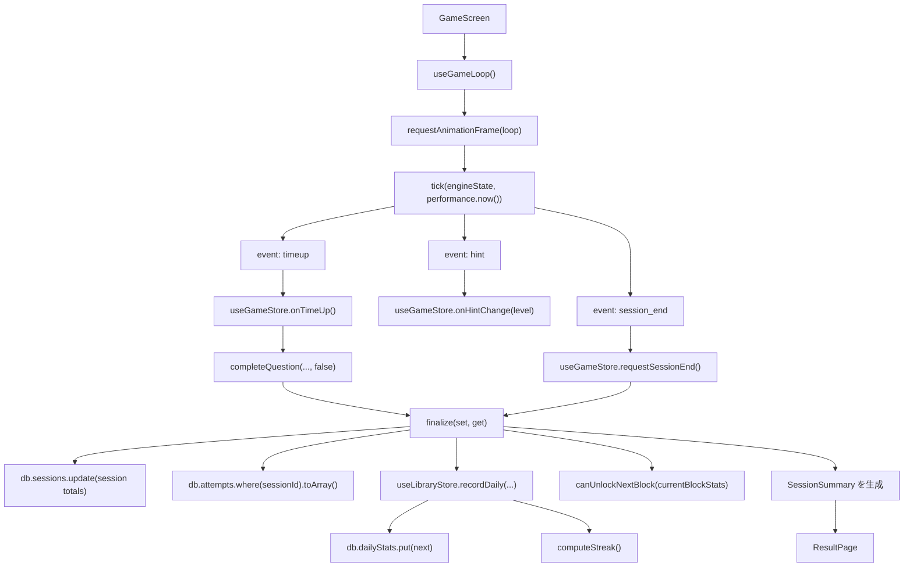

### 3.5 統計とバックアップ

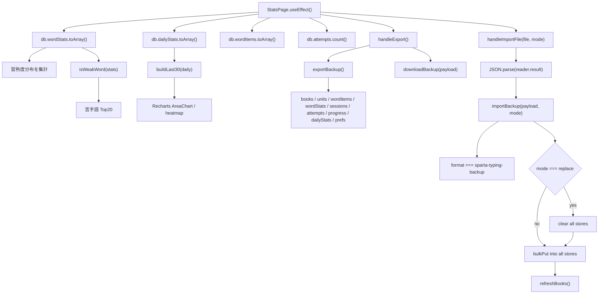

## 4. ER図

このアプリは Dexie で IndexedDB を使っています。リレーショナルDBではありませんが、`types.ts` と `db/db.ts` のストア定義から見ると、実質的なデータ関係は次のようになります。

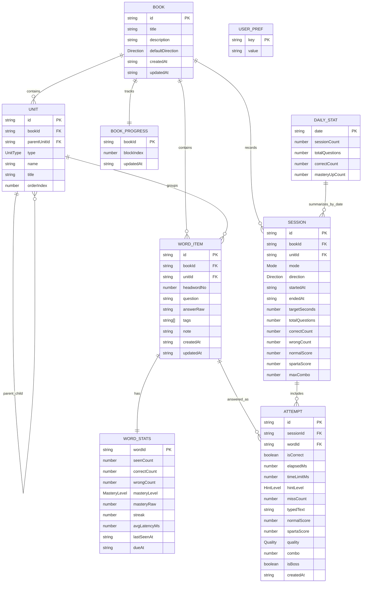

## 5. データフロー図

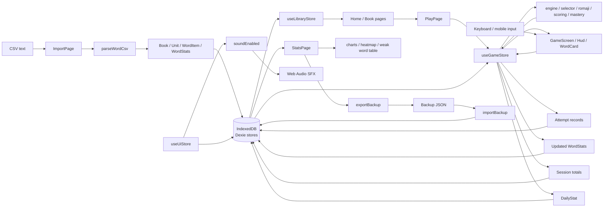

## 6. シーケンス図

### 6.1 CSVを登録して本を作る

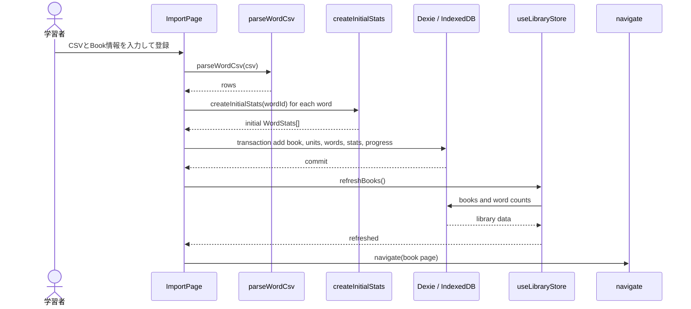

### 6.2 プレイ開始から1問を解く

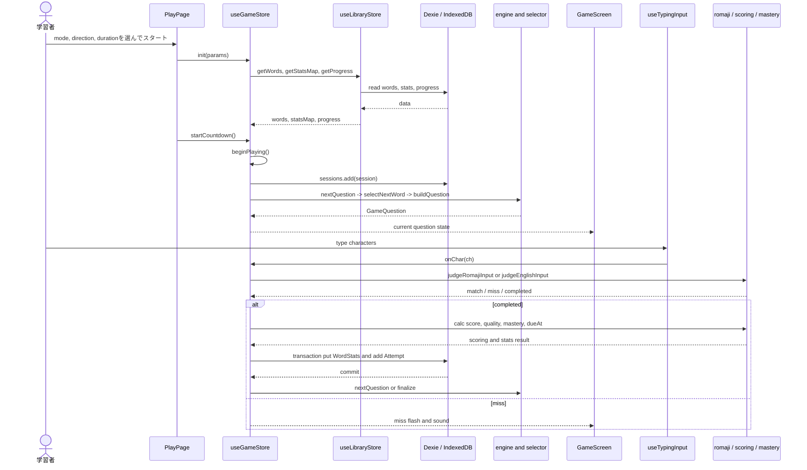

### 6.3 タイムアップまたは制限時間終了

```mermaid
sequenceDiagram
  participant GameScreen
  participant Loop as useGameLoop
  participant Engine as tick
  participant GameStore as useGameStore
  participant DB as Dexie / IndexedDB
  participant Library as useLibraryStore
  participant ResultPage

  GameScreen->>Loop: phase is playing
  Loop->>Engine: tick(engineState, now)
  Engine-->>Loop: hint / timeup / session_end events
  alt hint
    Loop->>GameStore: onHintChange(level)
  else timeup
    Loop->>GameStore: onTimeUp()
    GameStore->>GameStore: completeQuestion(false)
    GameStore->>DB: save Attempt and WordStats
  else session_end
    Loop->>GameStore: requestSessionEnd()
  end
  GameStore->>GameStore: finalize()
  GameStore->>DB: update Session totals
  GameStore->>DB: read Attempts for session
  GameStore->>Library: recordDaily(summary delta)
  Library->>DB: put DailyStat
  Library->>DB: compute streak from dailyStats
  GameStore-->>ResultPage: SessionSummary
```

### 6.4 統計閲覧とバックアップ

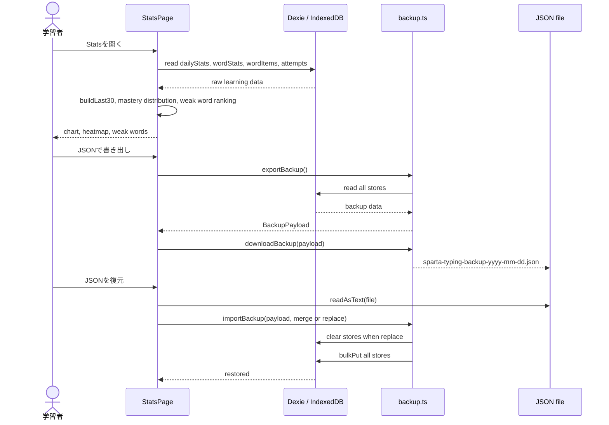
